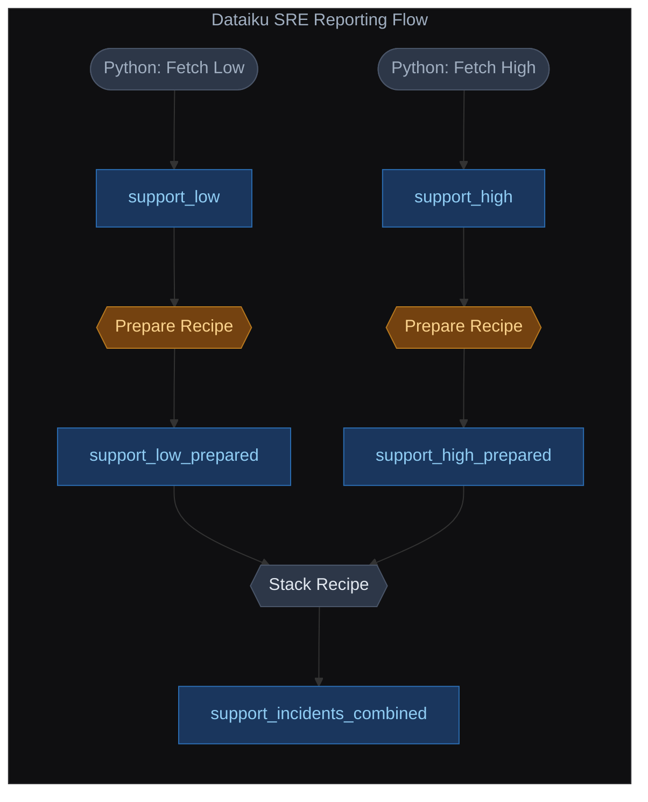

# PagerDuty SRE Event Fetcher & Reporting

An automated data pipeline built in Dataiku DSS to extract, tag, and aggregate PagerDuty SRE (Site Reliability Engineering) incident events. This repository tracks the version-controlled recipes, python notebooks, scenarios, and metadata configurations for the project.

## Flow Overview

## Project Overview

This project automates the ingestion and normalization of PagerDuty operational incident data to enable centralized SRE reporting. It separates incidents into discrete severity streams, normalizes the tracking metadata, and combines them into a unified reporting dataset.

## Data Pipeline Architecture

1. **Ingestion (Python Fetch Scripts)**
   * Utilizes the PagerDuty API endpoint to fetch raw incident log events.
   * Splits incidents based on tracking heuristics into two distinct operational buckets: `support_high_incidents` and `support_low_incidents`.

2. **Data Enrichment & Normalization (Prepare Recipes)**
   * **High Stream:** Processes severe incidents and injects a static tracking tag column: `incident_severity_level = "high"`.
   * **Low Stream:** Processes standard support incidents and injects a matching tracking tag column: `incident_severity_level = "low"`.

3. **Consolidation (Stack Recipe)**
   * Stacks both prepared datasets together into a single master output dataset: `support_incidents_P2OE4T3_PWVQZNH_stacked`.
   * Unifies schemas automatically based on identical columns so the source context (`high` vs `low`) is preserved in a single column without structural separation.

## Automation & Orchestration

The pipeline runs completely hands-free via a Dataiku **Time-based Scenario**:
* **Schedule:** Weekly (Every Monday at 2:00 AM)
* **Execution Strategy:** `Build everything upstream` — Triggering the scenario automatically forces the underlying Python scripts to query the fresh week's API logs, run the rows through the visual prepare steps, and refresh the final reporting dataset.

## Repository Structure

This repository reflects the standard version-control export format for a Dataiku project:
* `/recipes/` - JSON schemas and configurations defining the data flow transformations (prepare steps, stack alignments).
* `/scenarios/` - Automated tracking and triggering rules for the weekly refresh jobs.
* `/dashboards/` - Reporting layouts and metrics visualizations for SRE review.
* `/datasets/` - Metadata schemas and connectivity parameters for the input/output tables.
